# SiracusaDaily: documentazione tecnica

Ultimo aggiornamento: 11 agosto 2026  
Stato: sistema operativo in produzione, con generazione automatica di bozze Brevo

## Panoramica

SiracusaDaily è un sistema editoriale automatizzato che raccoglie informazioni pubbliche su Siracusa e provincia, le normalizza, filtra i contenuti non locali o non affidabili, deduplica le notizie, seleziona un'edizione equilibrata, genera testi editoriali in italiano e crea una campagna email in stato di bozza su Brevo.

La landing page, la dashboard operativa e il servizio immagini sono pubblicati su Netlify. Il motore editoriale viene eseguito da GitHub Actions e conserva lo storico operativo in un database SQLite su un branch Git separato.

```mermaid
flowchart LR
    A["Source map: 18 fonti, 49 endpoint"] --> B["Acquisizione RSS e HTML"]
    B --> C["Normalizzazione e SQLite"]
    C --> D["Filtro geografico e quarantene"]
    D --> E["Deduplicazione, ranking e fairness"]
    E --> F["Writer OpenAI con output JSON strutturato"]
    F --> G["Validazioni e correzioni"]
    G --> H["Renderer HTML prestabilito"]
    H --> I["Immagini su Netlify Blobs"]
    I --> J["Bozza Brevo"]
    J --> K["Revisione e invio manuale"]
```



## Motore

### Obiettivo operativo

Il motore risponde ogni giorno alla domanda editoriale: quali informazioni deve conoscere oggi una persona che vive a Siracusa o in uno dei comuni della provincia?

Il processo è progettato per:

- privilegiare la rilevanza locale;
- evitare duplicazioni della stessa notizia;
- mantenere una copertura equilibrata delle categorie;
- non far dominare stabilmente una singola testata;
- trattare eventi e opportunità con logiche temporali diverse dalle notizie;
- produrre una bozza completa ma non inviarla automaticamente;
- interrompere la pubblicazione quando viene meno un controllo essenziale.

### Componenti principali

Il backend è un package Python chiamato `siracusa-daily`, compatibile con Python 3.11 o superiore. GitHub Actions usa Python 3.12.

| Componente | Responsabilità |
|---|---|
| `config.py` | Caricamento delle fonti e degli endpoint attivi dai CSV |
| `retrieval.py` | Adapter RSS e HTML, parsing di eventi, bandi e offerte di lavoro |
| `geography.py` | Valutazione della pertinenza geografica |
| `event_quality.py` | Quarantena degli eventi sospetti provenienti dagli aggregatori generalisti |
| `opportunity_quality.py` | Verifica della sede effettiva delle opportunità |
| `database.py` | Persistenza SQLite, storico dei run, selezioni ed esclusioni |
| `selection.py` | Deduplicazione, ranking, scelta della fonte rappresentativa e fairness |
| `categories.py` | Classificazione preliminare e ordine delle sezioni |
| `events.py` | Finestra mobile, durata e ordinamento degli eventi |
| `opportunities.py` | Stato, scadenza, ordinamento e rotazione delle opportunità |
| `editorial.py` | Pacchetto evidenze, chiamata OpenAI, validazioni, riparazioni e oggetto |
| `images.py` | Estrazione, ottimizzazione e pubblicazione delle thumbnail |
| `writer.py` | Rendering deterministico Markdown o HTML |
| `brevo.py` | Controllo campagne, risoluzione lista e creazione della bozza |
| `pipeline.py` | Orchestrazione di ingestione e costruzione dell'edizione |
| `cli.py` | Interfaccia operativa e controlli di pubblicazione |

### Comandi disponibili

La CLI espone i seguenti comandi:

- `init`: inizializza il database;
- `preflight`: verifica database, chiave OpenAI, lista Brevo e presenza di una campagna per la data;
- `ingest`: esegue soltanto acquisizione e persistenza;
- `build`: costruisce una newsletter dai dati già presenti;
- `run`: esegue acquisizione, processing, generazione e opzionalmente pubblicazione;
- `brevo-draft`: riprova la sola creazione Brevo partendo da un run OpenAI già completato.

Il workflow di produzione usa:

```text
writer: gpt-5-mini
lookback notizie: 168 ore
item limit per endpoint: 30
limite notizie ordinarie: 10
limite eventi: 8
limite opportunità: 6
minimo contenuti pubblicabili: 6
output: HTML
destinazione: bozza Brevo
```

## Fonti e acquisizione

### Source map

La configurazione editoriale è separata dal codice:

- `backend/data/source_map.csv`: una riga per fonte editoriale;
- `backend/data/endpoint_map.csv`: una riga per endpoint operativo.

Al momento risultano attive 18 fonti e 49 endpoint:

- 36 endpoint RSS;
- 12 endpoint HTML automatizzati;
- 1 endpoint manuale, Instagram `#eventisiracusa`, registrato nella source map ma escluso dall'automazione.

Ogni fonte include almeno identificativo, nome, categoria, content bucket, URL, metodo di acquisizione, ambito geografico, frequenza, affidabilità, priorità editoriale, stato e note. Gli endpoint separano le diverse sezioni o interfacce della stessa fonte.

### Fonti attive

#### Testate locali

- SiracusaNews;
- SiracusaOggi.it;
- La Gazzetta Siracusana;
- Siracusa2000.com;
- La Civetta di Minerva.

Le testate vengono acquisite principalmente tramite feed RSS di categoria. Il filtro geografico resta obbligatorio perché alcune pubblicano anche notizie regionali o riferite ad altri territori.

#### Eventi

- Eventbrite, eventi a Siracusa;
- Comune di Siracusa;
- AllEvents, Siracusa;
- Eventi Siracusa;
- Virgilio Eventi, Siracusa;
- Instagram `#eventisiracusa`, solo come fonte manuale e non automatizzata.

AllEvents e Virgilio sono considerati aggregatori di discovery e sono sottoposti a un gate qualitativo più severo. Eventbrite, Comune ed Eventi Siracusa sono trattati come calendari più strutturati.

#### Lavoro e opportunità

- Comune di Siracusa;
- ConcorsiPubblici.com;
- ASP Siracusa;
- Randstad;
- Gi Group;
- Synergie;
- Centro per l'impiego di Siracusa, Regione Siciliana;
- inPA.

Non sono usati scraper LinkedIn né API commerciali aggiuntive.

### Adapter di acquisizione

#### RSS

Il parser RSS/Atom usa la standard library XML, legge titolo, link, data, estratto e autore, rimuove HTML e normalizza i permalink. Ogni endpoint restituisce al massimo il numero di elementi configurato, attualmente 30 nel workflow.

#### HTML e dati incorporati

Gli adapter specializzati sfruttano soltanto dati pubblicamente accessibili:

- Eventbrite: dati strutturati incorporati, date, orari e venue;
- Comune di Siracusa: card di eventi e contenuti istituzionali;
- AllEvents: dataset eventi incorporato nella pagina;
- Eventi Siracusa: endpoint pubblico delle entità Base44;
- Virgilio: microdati `schema.org/Event`;
- ConcorsiPubblici.com: schede di concorsi attivi;
- ASP Siracusa: procedure e concorsi pubblicati;
- Randstad: dataset pubblico incorporato nel sito;
- Gi Group: card HTML con sede e identificativo dell'offerta;
- Synergie: configurazione pubblica della ricerca Algolia e filtro entro la provincia;
- Centro per l'impiego: sezione territoriale e lettura PDF tramite `pypdf`;
- inPA: ricerca pubblica ufficiale filtrata per provincia e stato aperto.

Le letture di dettaglio delle opportunità sono parallelizzate con un massimo di sei worker. Gli endpoint principali sono invece processati uno alla volta, così gli errori restano attribuibili alla fonte specifica.

### Normalizzazione iniziale

Per ogni elemento viene creato un record `Article` contenente:

- fonte ed endpoint;
- titolo e URL canonico;
- data di pubblicazione o data operativa;
- estratto e autore;
- content bucket;
- timestamp di retrieval;
- punteggio e motivazioni geografiche;
- metadati strutturati per eventi, opportunità, qualità e immagini.

La canonicalizzazione:

- converte schema e host in minuscolo;
- rimuove frammenti e slash finali superflui;
- elimina parametri UTM e identificativi di tracking comuni;
- conserva i parametri funzionali necessari alla risorsa.

Un errore su un endpoint genera un warning e non interrompe l'acquisizione delle altre fonti.

## Processing

### Persistenza

SQLite è la memoria operativa del sistema. Usa modalità WAL e quattro tabelle principali:

| Tabella | Contenuto |
|---|---|
| `articles` | Articoli normalizzati, metadati, punteggio locale e URL univoco |
| `newsletter_runs` | Data edizione, writer, modello, oggetto, output e stato Brevo |
| `newsletter_items` | Posizione, articolo, cluster e punteggio per ciascun run |
| `newsletter_exclusions` | Elementi esclusi dal writer e relativa motivazione |

L'upsert avviene sulla `canonical_url`. Un nuovo retrieval aggiorna dati e metadati senza creare copie dello stesso URL.

### Filtro geografico

Il testo di titolo ed estratto viene normalizzato e confrontato con Siracusa, quartieri e comuni della provincia. Il punteggio cresce con il numero di località rilevate.

Regole principali:

- una località riconosciuta produce una base di 0,72;
- più riferimenti territoriali aumentano il punteggio fino a 1;
- “provincia di Siracusa” e “Libero Consorzio di Siracusa” portano il punteggio almeno a 0,9;
- alcune fonti istituzionali territoriali ricevono un minimo di 0,62 anche in assenza di un luogo nel titolo;
- la soglia di ammissione al dataset editoriale è 0,55;
- il nome della testata viene rimosso dai segnali, così “SiracusaNews” non rende automaticamente locale una notizia.

### Qualità degli eventi

Gli eventi datati provenienti da AllEvents e Virgilio devono dimostrare di essere rivolti a un pubblico locale italiano. Il gate può mettere in quarantena una scheda per:

- scrittura non latina prevalente;
- insufficiente evidenza linguistica italiana;
- descrizione troppo breve;
- organizzatore non verificabile;
- scheda troppo scarsa;
- duplicazione sospetta dello stesso evento in più lingue o alfabeti.

Gli elementi in quarantena restano nel database con stato e motivazioni, ma non raggiungono selezione e writer. Le fonti evento più strutturate non subiscono questa limitazione specifica, pur restando soggette agli altri controlli.

### Qualità delle opportunità

Una voce entra nel percorso persistente soltanto se è esplicitamente marcata come opportunità strutturata. La sede effettiva dichiarata nella scheda deve trovarsi a Siracusa o in provincia.

Sono messi in quarantena:

- offerte con sede fuori provincia;
- risultati ottenuti soltanto grazie al raggio geografico ma con luogo di lavoro diverso;
- procedure nazionali genericamente multi-sede senza un riferimento locale specifico;
- opportunità la cui sede viene esplicitamente marcata come non verificata.

### Finestra temporale

Le tre famiglie di contenuto usano regole diverse.

#### Notizie

- finestra corrente di produzione: ultime 168 ore;
- una notizia già inclusa in una precedente bozza Brevo riuscita viene esclusa;
- l'esclusione si estende all'intero cluster, quindi rimuove anche duplicati successivi provenienti da altre fonti.

#### I prossimi eventi

- finestra mobile di sette giorni: oggi più i sei giorni successivi;
- la data considerata è quella dell'evento, non quella di pubblicazione;
- un evento già iniziato rimane visibile se la data di fine cade nella finestra;
- gli eventi vengono ordinati cronologicamente;
- possono ricomparire nelle edizioni successive finché restano nella finestra;
- limite operativo: 8.

#### Lavoro e opportunità

- una scadenza resta valida per l'intera giornata locale indicata;
- stati chiusi, scaduti o non disponibili escludono immediatamente la voce;
- senza scadenza sono ammessi soltanto stati aperti o elencati;
- una voce senza scadenza tollera fino a tre giorni dall'ultima verifica positiva;
- le scadenze entro sette giorni hanno priorità;
- possono ricomparire finché risultano attive;
- limite operativo: 6.

### Deduplicazione

Gli articoli vengono raggruppati in cluster tramite una combinazione trasparente di:

- similarità Jaccard tra token dei titoli, soglia 0,50;
- similarità sequenziale dei titoli, soglia 0,82;
- sovrapposizione tra titolo e contesto dell'estratto;
- finestra massima ordinaria di 96 ore;
- data, luogo e parole distintive per gli eventi;
- nessun limite temporale per le opportunità persistenti.

Il cluster mantiene tutte le fonti che hanno trattato lo stesso fatto, ma pubblica un solo rappresentante e un solo link.

### Ranking

Il punteggio qualitativo di un articolo combina:

```text
località × 3,2
+ affidabilità fonte × 1,4
+ priorità editoriale
+ freschezza × 1,8
+ completezza estratto × 0,6
```

La freschezza decade esponenzialmente con costante di 36 ore. La completezza raggiunge il massimo a 400 caratteri di estratto.

Al punteggio del cluster si aggiungono:

- fino a 0,8 punti per corroborazione da fonti differenti;
- un vantaggio moderato di 0,45 alla prima notizia valida di una categoria ancora scoperta;
- uno spareggio minimo a favore delle fonti usate meno recentemente.

Il limite ordinario è di tre elementi per fonte. Se la fonte migliore ha raggiunto il limite, il sistema prova a scegliere un altro rappresentante dello stesso cluster.

Per le opportunità viene applicato anche un round-robin tra fonti, preservando l'ordine editoriale interno di ciascuna fonte.

### Classificazione

L'ordine di presentazione è:

1. Notizie e cronaca;
2. Politica ed economia;
3. Cultura;
4. Sport;
5. Servizi e utilità;
6. I prossimi eventi;
7. Lavoro e opportunità.

La classificazione iniziale usa content bucket e parole chiave. Il writer può correggere semanticamente la sezione delle notizie ordinarie. Gli eventi datati e le opportunità strutturate vengono invece forzati nelle rispettive sezioni dopo la risposta del modello.

## Generazione

### Pacchetto di evidenze

OpenAI riceve soltanto dati strutturati per ciascun candidato:

- `candidate_id` controllato dal motore;
- titolo ed estratto della fonte;
- nome e URL della fonte;
- data di riferimento e sua semantica;
- content bucket;
- evidenze geografiche;
- altre fonti che corroborano il cluster.

URL, attribuzioni e associazione tra candidato e articolo non vengono generati dal modello.

### Writer OpenAI

Il modello predefinito è `gpt-5-mini`, chiamato tramite Responses API. Le richieste usano:

- JSON Schema in modalità strict;
- `store: false`;
- timeout di produzione di 240 secondi;
- fino a 3 tentativi per timeout, errori di rete, HTTP 408, 409, 429 e 5xx;
- backoff esponenziale limitato a 10 secondi.

Per ogni candidato il modello deve restituire:

- `candidate_id`;
- decisione `publishable`;
- eventuale motivazione di esclusione;
- headline;
- summary;
- sezione;
- formulazione di riserva per l'oggetto.

Restituisce inoltre l'oggetto dell'edizione e da uno a tre ID che ne dimostrano il grounding.

### Contratto editoriale

- Tutto il testo deve essere in italiano, anche quando la fonte è straniera.
- La headline deve essere informativa, sobria e lunga al massimo 110 caratteri.
- La summary deve essere autosufficiente, conclusiva e diversa dal titolo.
- La lunghezza ideale della summary è 170-230 caratteri; il massimo assoluto è 240.
- Non sono ammessi troncamenti, puntini di sospensione, clickbait, URL o inviti all'azione.
- L'em dash non è consentito.
- Numeri, date e quantità devono comparire nelle evidenze.
- Eventi e opportunità devono conservare luogo, data o scadenza quando disponibili.
- Se le evidenze non bastano, il candidato deve essere escluso invece di essere riempito con testo generico.

### Oggetto

L'oggetto è generato ad hoc per ogni edizione, senza prefissi o pattern ricorrenti. Deve:

- essere lungo tra 20 e 90 caratteri;
- basarsi su uno, due o tre contenuti effettivamente pubblicati;
- non contenere SiracusaDaily, la data o formule come “Siracusa oggi”;
- non contenere puntini di sospensione o em dash;
- non inventare numeri;
- evitare decessi, vittime, incidenti gravi, violenza, abusi, cronaca nera, catastrofi e formulazioni emotivamente forti.

Se l'oggetto generato non supera i controlli, il motore cerca un `subject_topic` sicuro tra i contenuti. Se nessun contenuto è utilizzabile, la bozza viene bloccata.

### Validazione e riparazione

Il motore valida in modo deterministico:

- presenza e unicità dei candidate ID;
- struttura e tipi richiesti;
- limiti di headline, summary e subject topic;
- punteggiatura conclusiva;
- categoria ammessa;
- assenza di em dash e troncamenti;
- grounding numerico;
- grounding e sicurezza dell'oggetto.

I soli candidati non validi vengono reinviati al modello con gli errori puntuali. Sono consentiti fino a tre round di correzione. Un candidato che continua a fallire viene escluso e registrato; non blocca gli altri contenuti. Un errore complessivo e persistente dell'API OpenAI interrompe invece il run.

Esiste un writer `fallback` esplicito per uso tecnico, ma una newsletter fallback non può essere pubblicata su Brevo né inviata via email. In produzione non esiste un downgrade silenzioso.

### Rendering HTML

L'HTML non viene scritto quotidianamente dal modello. Il template è deterministico e risiede in `writer.py`; il writer AI produce esclusivamente contenuti strutturati.

Caratteristiche del template:

- larghezza massima 640 px;
- layout email basato su tabelle e stili inline;
- sfondo bianco;
- logo centrale `🗞️ SiracusaDaily` e data dell'edizione;
- card di categoria con sfondo a lieve contrasto e angoli arrotondati;
- colore stabile per ciascuna categoria;
- titoli in Arial, 22 px per il primo elemento e 20 px per i successivi;
- summary a 16 px;
- link esplicito alla fonte;
- data e ora evidenti per gli eventi;
- scadenza e indicazione “In scadenza” per le opportunità urgenti;
- breakpoint mobile a 480 px;
- link di disiscrizione Brevo nel footer;
- nessun riferimento alla generazione automatica e nessuna data di pubblicazione ordinaria.

### Immagini

Il sistema prova a pubblicare una thumbnail sul primo elemento di:

- Notizie e cronaca;
- Cultura;
- Sport;
- I prossimi eventi.

La ricerca segue quest'ordine: Open Graph, Twitter Card, `image_src`, JSON-LD. Sono rifiutati URL riconducibili a loghi, avatar, placeholder, favicon, pixel di tracking e immagini predefinite.

La risorsa:

- può pesare al massimo 8 MB in ingresso;
- deve misurare almeno 320×180;
- viene corretta secondo l'orientamento EXIF;
- viene ritagliata a 480×300;
- viene convertita in JPEG;
- deve pesare al massimo 180 KB;
- viene caricata nel Blob store Netlify con chiave deterministica per data, categoria e URL articolo.

L'endpoint Netlify accetta in upload soltanto JPEG autenticati, con chiave conforme e massimo 300 KB. Le immagini pubbliche hanno cache annuale e URL stabile. Un 403 della fonte, un'immagine assente o un errore di upload produce un warning e omette soltanto quella thumbnail.

## Quality Assurance

### Test automatici

Il repository contiene attualmente 89 test automatici eseguiti prima di ogni run:

- 79 test di pipeline;
- 10 test dedicati alle immagini.

La suite copre, tra le altre cose:

- parser RSS, HTML, JSON, microdata e PDF;
- canonicalizzazione URL;
- filtro geografico;
- deduplicazione cross-source;
- limiti e rotazione delle fonti;
- finestra mobile degli eventi;
- quarantena di eventi stranieri o multilingua sospetti;
- persistenza e scadenza delle opportunità;
- verifica della sede delle offerte di lavoro;
- classificazione delle categorie;
- grounding numerico;
- limiti, lingua, punteggiatura ed em dash;
- correzioni selettive del writer;
- protezione dell'oggetto sensibile;
- rendering HTML, ordine sezioni, date e scadenze;
- creazione della sola bozza Brevo e idempotenza;
- estrazione, compressione e upload delle thumbnail.

Se un test fallisce, GitHub Actions non avvia il motore editoriale.

### Gate di pubblicazione

Prima di creare una bozza devono essere veri tutti i seguenti punti:

- database accessibile;
- `OPENAI_API_KEY` configurata;
- lista Brevo risolta in modo univoco;
- nessuna campagna Brevo già esistente per la data;
- writer effettivamente OpenAI;
- output HTML valido e inferiore a 1 MB;
- almeno 6 contenuti pubblicabili;
- oggetto valido e grounded;
- secondo controllo Brevo immediatamente prima della creazione.

La pipeline crea soltanto una bozza. La revisione editoriale su Brevo rimane il controllo umano finale prima dell'invio.

### Comportamento in caso di errore

| Errore | Comportamento |
|---|---|
| Singolo endpoint non raggiungibile | Warning, le altre fonti proseguono |
| Evento o opportunità sospetta | Quarantena, non raggiunge il writer |
| Candidato AI non valido | Correzione mirata; poi esclusione del solo candidato |
| OpenAI non disponibile dopo i retry | Run fallito, nessuna bozza |
| Immagine assente, bloccata o non valida | Thumbnail omessa, bozza invariata |
| Brevo non raggiungibile nel preflight | Run interrotto prima della produzione |
| Campagna già esistente | Run ignorato senza costi OpenAI |
| Meno di 6 contenuti | Bozza bloccata |
| Fallimento GitHub Actions | Issue GitHub automatica |

### Verifica client email

Il template è costruito con tabelle, stili inline e una media query mobile, ed è controllato tramite le anteprime di Brevo. Non esiste attualmente una suite automatizzata esterna di rendering su Gmail, Apple Mail e Outlook; questa verifica è deliberatamente affidata all'anteprima Brevo e alla revisione umana.

## Publishing e operations

### Pianificazione

Il workflow `.github/workflows/newsletter-daily.yml` usa il fuso `Europe/Rome` e tre trigger giornalieri:

- 06:30: run principale;
- 07:00: recupero;
- 07:30: secondo recupero.

I recuperi eseguono il controllo Brevo prima del retrieval. Se la campagna esiste già, terminano senza chiamare OpenAI. GitHub Actions può avviare il job con ritardo rispetto all'orario nominale a causa della coda del servizio.

È disponibile anche `workflow_dispatch` con due modalità:

- `preflight`: verifica l'infrastruttura senza generare contenuti;
- `full`: esegue l'intera pipeline e crea la bozza.

### Idempotenza e concorrenza

- Il workflow usa un gruppo di concorrenza unico e non cancella un run già attivo.
- Brevo è la fonte autoritativa per stabilire se esiste già un'edizione.
- Il controllo considera bozze, campagne programmate e campagne inviate.
- La verifica viene eseguita prima del retrieval e di nuovo immediatamente prima della POST di creazione.
- Il nome campagna segue `SiracusaDaily | dd/mm/aaaa | run N`.

### Brevo

La campagna viene creata nella lista `Iscritti SiracusaDaily`, attualmente ID 7, con:

- mittente `SiracusaDaily <newsletter@siracusadaily.com>`;
- reply-to `ciao@siracusadaily.com`;
- contenuto HTML completo;
- oggetto generato e validato;
- parametro UTM `SiracusaDaily YYYYMMDD`;
- stato iniziale di bozza.

L'invio non è automatizzato. Un operatore apre Brevo, controlla contenuti e anteprima e decide quando inviare o programmare.

### Iscrizione utenti

La landing page incorpora un form Brevo diretto con:

- email obbligatoria;
- consenso privacy obbligatorio;
- reCAPTCHA;
- honeypot;
- messaggio esplicito di successo o errore;
- conferma semplice configurata lato Brevo;
- collegamento alla privacy policy.

### Esecuzione locale

Il setup locale crea un virtual environment, installa il package, inizializza SQLite e prepara `.env.local`:

```bash
cd backend
scripts/setup_local.sh
scripts/run_daily.sh
```

Il run locale usa `backend/runtime/` per database, HTML e log. Le immagini sono disattivate per impostazione predefinita; per pubblicarle su Netlify servono modalità `netlify` e token dedicato.

Il LaunchAgent macOS incluso è soltanto una procedura di emergenza. Non deve essere attivo insieme a GitHub Actions; il suo plist storico è configurato alle 09:30.

## Monitoring e logging

### Log di esecuzione

Il motore scrive nel log:

- endpoint riusciti e tentati;
- articoli acquisiti e articoli riconosciuti come locali;
- eventi e opportunità in quarantena;
- warning per singolo endpoint;
- immagini tentate, pubblicate e saltate;
- warning immagini;
- ID del run editoriale;
- numero di contenuti finali;
- writer e percorso output;
- ID campagna e lista Brevo.

### GitHub Actions

Ogni run espone stato e durata dei passaggi:

- setup e test;
- preflight;
- motore editoriale;
- consolidamento database;
- persistenza;
- archiviazione.

HTML e log vengono conservati come artifact per 7 giorni. In caso di fallimento viene aperta una issue GitHub con data e collegamento al run; per la stessa data non viene aperta una seconda issue identica.

Il timeout massimo del job è 55 minuti.

### Persistenza anche in caso di errore

Il checkpoint SQLite e il salvataggio del branch operativo vengono eseguiti con `if: always()` nei run completi. Gli articoli già acquisiti non vengono quindi persi se una fase successiva fallisce.

### Limiti attuali del monitoring

- Non esiste un sistema esterno di alerting oltre alle issue GitHub.
- I warning dei singoli endpoint non producono alert separati.
- La copertura immagini è disponibile nei log ma non ancora come KPI storico in dashboard.
- Le motivazioni di quarantena sono nel database, non visualizzate nella dashboard.

## Analytics

### Dashboard

La pagina `/dashboard` è una control room one-page. Il browser invia un bearer token a una Netlify Function; il token è conservato soltanto in `sessionStorage`. Le credenziali Brevo, OpenAI e GitHub rimangono sul server.

Sono disponibili finestre di 7, 30 e 90 giorni. Le tre sorgenti vengono interrogate in parallelo e con isolamento degli errori: se un provider fallisce, gli altri dati restano disponibili insieme a un avviso.

### Metriche Brevo

- bozze presenti;
- campagne inviate;
- email inviate e consegnate;
- delivery rate;
- aperture uniche e open rate;
- clicker unici, CTR e CTOR;
- bounce hard e soft;
- disiscrizioni;
- segnalazioni spam;
- iscritti attivi e contatti in blacklist;
- dettaglio delle campagne SiracusaDaily.

Le formule principali sono:

```text
open rate = aperture uniche / consegnate
CTR = clicker unici / consegnate
CTOR = clicker unici / aperture uniche
delivery rate = consegnate / inviate
```

Le aperture sono influenzate dai sistemi di privacy e prefetch dei client email e vanno interpretate insieme ai clic, non come misura assoluta di lettura.

### Metriche OpenAI

Con una Admin Key vengono letti:

- richieste al modello;
- token di input;
- token di input in cache;
- token di output;
- costo in USD;
- andamento giornaliero.

`OPENAI_PROJECT_ID` limita l'analisi al progetto SiracusaDaily. Se non è configurato, i valori possono rappresentare l'intera organizzazione OpenAI.

### Metriche GitHub Actions

- run totali, completati e riusciti;
- success rate;
- durata media totale;
- durata media dei singoli componenti;
- elenco degli ultimi run con evento, stato, durata e link.

Le medie per step usano gli ultimi 12 run completati; l'elenco visualizzato è limitato agli ultimi 15.

### Dati non ancora aggregati

La dashboard non legge attualmente SQLite. Non espone quindi come serie storiche:

- distribuzione dei contenuti per categoria;
- rotazione effettiva delle fonti;
- cluster deduplicati;
- esclusioni del writer;
- motivazioni di quarantena;
- copertura e fallimenti delle immagini.

Questi dati esistono nel database o nei log e possono essere aggiunti in futuro senza modificare la pipeline editoriale.

## Infrastructure

### Stack

| Area | Tecnologia | Ruolo |
|---|---|---|
| Repository | GitHub privato `adseeker/siracusadaily` | Codice, workflow e issue |
| Automazione | GitHub Actions, Ubuntu | Scheduler e motore quotidiano |
| Backend | Python 3.12 in produzione | Retrieval, processing e generazione |
| Persistenza | SQLite WAL | Articoli, run e storico editoriale |
| Writer | OpenAI Responses API, `gpt-5-mini` | Headline, summary, categoria e oggetto |
| Email | Brevo API v3 | Lista, campagne, statistiche e form |
| Frontend | Next.js 16, React 19, TypeScript | Landing, privacy e dashboard |
| Hosting | Netlify | Export statico e Functions |
| Immagini | Pillow e Netlify Blobs | Thumbnail e CDN |
| PDF | pypdf | Avvisi del Centro per l'impiego |
| Dominio | `siracusadaily.com` | Sito, mittente e identità email |

### Deploy web

Next.js usa `output: export`. Netlify esegue:

```text
build command: npm run build
publish directory: out
Node.js: 22
```

Ogni push su `main` attiva il deploy del sito e delle Netlify Functions.

### Branch e stato

- `main`: codice e configurazione;
- `automation-state`: database `siracusa_daily.db` aggiornato dal workflow.

Il database viene sottoposto a checkpoint WAL, committato dal bot e usato dal run successivo. Questa scelta evita un server database e mantiene basso il costo operativo, ma presuppone un solo writer concorrente.

### Netlify Functions

#### `dashboard.mjs`

- accetta soltanto GET;
- richiede `DASHBOARD_ACCESS_TOKEN`;
- confronta il token in tempo costante;
- interroga Brevo, OpenAI e GitHub con timeout di 15 secondi;
- restituisce dati con `private, no-store`;
- consente degradazione parziale dei provider.

#### `newsletter-image.mjs`

- accetta GET, HEAD e PUT;
- PUT richiede `SIRACUSA_IMAGE_UPLOAD_TOKEN`;
- ammette soltanto JPEG e verifica la firma binaria;
- limita l'upload a 300 KB;
- valida la chiave con regex e categorie consentite;
- salva nel Blob store `newsletter-images`;
- espone lettura pubblica con ETag e cache annuale.

### Segreti GitHub

| Variabile | Utilizzo |
|---|---|
| `OPENAI_API_KEY` | Generazione editoriale |
| `BREVO_API_KEY` | Preflight e creazione bozza |
| `SIRACUSA_IMAGE_UPLOAD_TOKEN` | Upload protetto delle thumbnail |

### Variabili Netlify

| Variabile | Utilizzo |
|---|---|
| `DASHBOARD_ACCESS_TOKEN` | Accesso alla control room |
| `BREVO_API_KEY` | Metriche campagne e lista |
| `BREVO_LIST_ID` | Lista SiracusaDaily, attualmente 7 |
| `OPENAI_ADMIN_KEY` | Uso e costi dell'organizzazione |
| `OPENAI_PROJECT_ID` | Filtro del progetto OpenAI |
| `GITHUB_DASHBOARD_TOKEN` | Lettura read-only dei workflow |
| `GITHUB_REPOSITORY` | Repository monitorata |
| `SIRACUSA_IMAGE_UPLOAD_TOKEN` | Autorizzazione upload immagini |

I valori segreti non vengono incorporati nel bundle statico o inviati al browser.

### Sicurezza e deliverability

- Repository privata.
- Segreti cifrati in GitHub e Netlify.
- Token dashboard e immagini confrontati con `timingSafeEqual`.
- Nessuna chiave provider nel frontend.
- Upload immagini limitato per tipo, firma, dimensione e naming.
- Header web `X-Content-Type-Options`, `Referrer-Policy` e `X-Frame-Options`.
- Dominio mittente autenticato in Brevo con SPF, DKIM e DMARC.
- Il blocco Brevo degli IP sconosciuti deve essere disattivato per le API key perché gli IP dei runner GitHub cambiano; il blocco SMTP può restare attivo.
- Link di disiscrizione inserito nell'HTML Brevo.

### Dipendenze e costi operativi

Le dipendenze Python runtime sono limitate a Pillow e pypdf. Il frontend usa Next.js, React e `@netlify/blobs`.

Le superfici di costo sono:

- chiamate OpenAI, variabili in base al numero di candidati e ai retry;
- piano Brevo e volume email;
- piano Netlify e traffico delle immagini;
- eventuali minuti GitHub Actions oltre la quota inclusa.

L'acquisizione delle fonti non usa API commerciali aggiuntive.

### Backup e retention

- Database operativo: storico Git del branch `automation-state`;
- HTML e log: artifact GitHub per 7 giorni;
- campagne e statistiche: conservazione Brevo;
- immagini: Netlify Blobs, senza pulizia automatica attualmente configurata;
- codice e configurazione: branch `main` del repository privato.

### Limiti architetturali noti

- SQLite e branch di stato sono adatti a un singolo processo, non a più worker editoriali concorrenti.
- Il retrieval HTML dipende dalla struttura pubblica dei siti e può richiedere manutenzione quando cambia il markup.
- Le fonti social Meta e LinkedIn non sono automatizzate.
- Le immagini possono mancare quando una fonte blocca il download o non espone metadati idonei.
- L'invio resta manuale e richiede una revisione su Brevo.
- Non esiste ancora un pannello editoriale per modificare la selezione prima della creazione della bozza.

## Riferimenti nel repository

- `README.md`: panoramica di sito e dashboard;
- `backend/README.md`: operazioni del motore;
- `backend/docs/source-map-methodology.md`: struttura e manutenzione delle fonti;
- `backend/data/source_map.csv`: dataset fonti;
- `backend/data/endpoint_map.csv`: dataset endpoint;
- `.github/workflows/newsletter-daily.yml`: automazione di produzione;
- `netlify.toml`: build e Functions;
- `backend/tests/`: suite di verifica.
