# SiracusaDaily: documentazione tecnica

Ultimo aggiornamento: 28 agosto 2026 
Stato: sistema operativo in produzione, con programmazione automatica delle campagne Brevo

## Panoramica

SiracusaDaily è un sistema editoriale automatizzato che raccoglie informazioni pubbliche su Siracusa e provincia, le normalizza, filtra i contenuti non locali o non affidabili, deduplica le notizie, seleziona un'edizione equilibrata, genera testi editoriali in italiano, programma una campagna email su Brevo e prepara un recap Facebook per la pubblicazione manuale.

La landing page, la dashboard operativa, il servizio immagini e il trigger di
recovery sono pubblicati su Netlify. Il motore editoriale viene eseguito da GitHub
Actions e conserva lo storico operativo in un database SQLite su un branch Git
separato. GitHub tenta l'avvio alle 06:30 e alle 07:00; alle 07:30 Netlify richiama
lo stesso workflow per evitare che un mancato evento schedulato impedisca la
produzione quotidiana.

```mermaid
flowchart LR
    O["GitHub schedule 06:30 e 07:00"] --> P["Workflow GitHub Actions"]
    Q["Netlify recovery 07:30"] --> P
    P --> A["Source map: 18 fonti, 49 endpoint"]
    A --> B["Acquisizione RSS e HTML"]
    B --> C["Normalizzazione e SQLite"]
    C --> D["Filtro geografico e quarantene"]
    D --> E["Deduplicazione, ranking e fairness"]
    E --> F["Writer OpenAI con output JSON strutturato"]
    F --> G["Validazioni e correzioni"]
    G --> H["Renderer HTML prestabilito"]
    H --> I["Immagini su Netlify Blobs"]
    I --> J["Campagna Brevo"]
    J --> K["Invio programmato con kill switch"]
    G --> L["Recap e fonti Facebook"]
    L --> M["Pagina operativa Notion"]
    M --> N["Pubblicazione manuale dopo l'email"]
```

## Indice

| Area | Contenuto |
|---|---|
| [1. Motore](docs/technical/01-motore.md) | Obiettivi, componenti Python, responsabilità e comandi operativi |
| [2. Fonti e acquisizione](docs/technical/02-fonti-acquisizione.md) | Source map, fonti attive, adapter RSS/HTML e normalizzazione iniziale |
| [3. Processing](docs/technical/03-processing.md) | Persistenza, località, quarantene, finestre temporali, deduplicazione, ranking e categorie |
| [4. Generazione](docs/technical/04-generazione.md) | Writer OpenAI, contratto editoriale, oggetto, validazioni, HTML e immagini |
| [5. Quality Assurance](docs/technical/05-quality-assurance.md) | Test, gate di pubblicazione, gestione degli errori e verifica email |
| [6. Publishing e operations](docs/technical/06-publishing-operations.md) | Scheduler, idempotenza, Brevo, iscrizioni ed esecuzione locale |
| [7. Monitoring e logging](docs/technical/07-monitoring-logging.md) | Log, GitHub Actions, persistenza e limiti del monitoraggio |
| [8. Analytics](docs/technical/08-analytics.md) | Dashboard e metriche Brevo, OpenAI e GitHub Actions |
| [9. Infrastructure](docs/technical/09-infrastructure.md) | Stack, deploy, branch, Functions, segreti, sicurezza, costi, backup e limiti |

## Percorsi rapidi

- Per capire come nasce una newsletter: [Fonti e acquisizione](docs/technical/02-fonti-acquisizione.md) → [Processing](docs/technical/03-processing.md) → [Generazione](docs/technical/04-generazione.md).
- Per gestire la produzione quotidiana: [Quality Assurance](docs/technical/05-quality-assurance.md) → [Publishing e operations](docs/technical/06-publishing-operations.md) → [Monitoring e logging](docs/technical/07-monitoring-logging.md).
- Per controllare prestazioni e costi: [Analytics](docs/technical/08-analytics.md) → [Infrastructure](docs/technical/09-infrastructure.md).

## Documentazione correlata

- [`README.md`](README.md): panoramica di sito e dashboard;
- [`backend/README.md`](backend/README.md): configurazione ed esecuzione del motore;
- [`backend/docs/source-map-methodology.md`](backend/docs/source-map-methodology.md): struttura e manutenzione delle fonti;
- [`backend/data/source_map.csv`](backend/data/source_map.csv): dataset fonti;
- [`backend/data/endpoint_map.csv`](backend/data/endpoint_map.csv): dataset endpoint;
- [`.github/workflows/newsletter-daily.yml`](.github/workflows/newsletter-daily.yml): automazione di produzione;
- [`netlify.toml`](netlify.toml): build e Functions;
- [`backend/tests/`](backend/tests/): suite di verifica.
